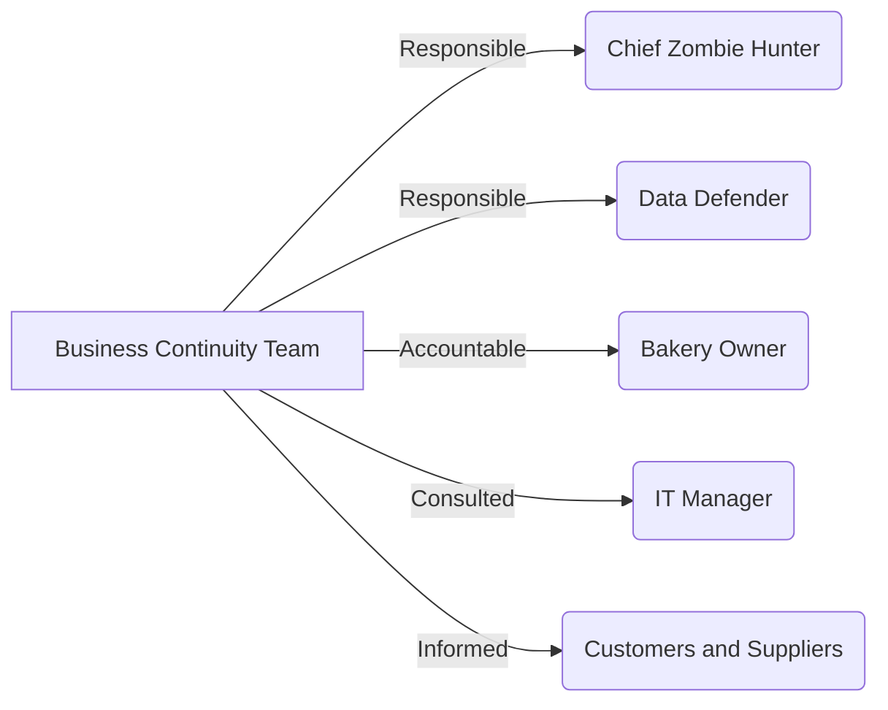

# Business Continuity and Disaster Recovery (BCDR) Plan

## Introduction

Welcome to our Business Continuity and Disaster Recovery (BCDR) Plan! This plan outlines the steps and procedures to ensure the continuity of our business operations and data protection during unexpected events, such as cyberattacks, natural disasters, or even a zombie apocalypse! 🧟‍♂️

## Risk Assessment

We have conducted a thorough risk assessment to identify potential threats to our business. From server failures to the undead, we've got it covered! We've analyzed the impact of each risk and developed mitigation strategies to minimize disruptions.

## BCDR Roles and Responsibilities

To ensure a well-coordinated response, we have assigned specific roles to team members for incident management. Let's take a look at our RACI chart to understand who's responsible for what:

## Data Backup and Storage

Data is the lifeblood of our business, so we've got it covered! Our backups are not just protected within the bakery's oven; they are securely stored offsite in the cloud 🌥️. No zombie attack or fire 🔥 can touch our valuable data!

## BCDR Testing and Drills

Practice makes perfect, even in the face of the undead! We conduct regular BCDR testing and drills to ensure our team is well-prepared for any disaster scenario. Plus, it's a fun opportunity to role-play as zombie-fighting heroes! 🧟‍♀️🦸‍♂️

## Incident Response and Communication

In case of an emergency, we have well-defined communication channels, so everyone knows what to do and where to go. We'll keep you updated on all our communication channels, whether it's over the phone or through our trusty pigeon messengers! 📞🐦

## Business Continuity Scenarios

Let's face it; zombies are just one of the many potential threats. So, we've prepared for all sorts of situations. From earthquakes to alien invasions, we've got a plan for every eventuality. Safety first, always! 🌍👽

## External Resources and Support

In case our zombie-fighting skills are put to the test beyond our capacity, we have strategic alliances with external resources, including disaster recovery service providers, to back us up when needed.

## Continuous Improvement

Our BCDR plan isn't static; it evolves as our business does! We encourage feedback from our team and customers to continuously improve our preparedness and response to any unexpected event.

## Conclusion

Our BCDR plan is like a secret recipe for resilience! It's designed to ensure we continue serving our delicious treats to our loyal customers, no matter what the world throws at us. We're ready for any challenge, be it a delightful bakery surprise or a surprising zombie encounter! 🍪🥖🎉

Remember, safety is our top priority, and we're committed to protecting your data and ensuring business continuity. Now, let's keep calm and carry on baking, knowing that we're prepared for any adventure that comes our way! Stay safe and eat well! 😄🍰

#BCDR #BusinessContinuity #DisasterRecovery #ZombieApocalypse #Preparedness
